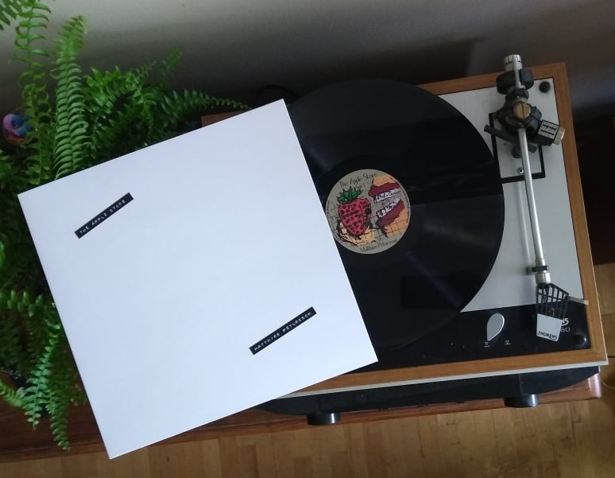

	<h5>23. Dec 2023</h5>
	<h1>Third Album and Single is out!!</h1>
	

		<iframe style="border-radius:12px" src="https://open.spotify.com/embed/album/7pE7KC4xnE7Zqv0QsiBgt6?utm_source=generator" width="300" height="380" frameBorder="0" allowfullscreen="" allow="autoplay; clipboard-write; encrypted-media; fullscreen; picture-in-picture" loading="lazy"></iframe>

		<iframe style="border: 0; width: 350px; height: 470px;" src="https://bandcamp.com/EmbeddedPlayer/album=1472058106/size=large/bgcol=ffffff/linkcol=e99708/tracklist=false/transparent=true/" seamless><a href="https://matthiaspetursson.bandcamp.com/album/litla-j-laser-an">Litla Jólaserían by Matthías Pétursson</a></iframe>
	

	

		<iframe style="border-radius:12px" src="https://open.spotify.com/embed/album/7xL2scHUOfgpY61gWiP1w1?utm_source=generator" width="300" height="380" frameBorder="0" allowfullscreen="" allow="autoplay; clipboard-write; encrypted-media; fullscreen; picture-in-picture" loading="lazy"></iframe>
			
		<iframe style="border: 0; width: 350px; height: 442px;" src="https://bandcamp.com/EmbeddedPlayer/track=1011798140/size=large/bgcol=ffffff/linkcol=7137dc/tracklist=false/transparent=true/" seamless><a href="https://matthiaspetursson.bandcamp.com/track/l-til-skata">Lítil Óskata by Matthías Pétursson</a></iframe>
	

	<h5>18. May 2023</h5>
	<h1>Big update to Dream of Songs!</h1>

	

		
	

	

		
I just made a big update to my video game, Dream of Songs. Click <a href="/dreamofsongs" target="_blank">here</a> to check it out. Main things added:

		<ul>
			<li>Highscore !!!</li>
			<li>Save/load feature</li>
			<li>Difficulty reduced</li>
		</ul>
		
Now you can close the tab and continue where you left off, and it is now easier (still quite hard, but now it's not nearly impossible) to get all the chests if you're smart enough.

	

	<h5>22. Apr 2021</h5>
	<h1>SECOND ALBUM AND VINYL IS OUT !!!</h1>



	<h5>31. Mar 2020</h5>
	<h1>VINYL IS OUT !!!</h1>

	
	

	<h5>30. Oct 2019</h5>
	<h1>ALBUM IS OUT !!!</h1>

	

